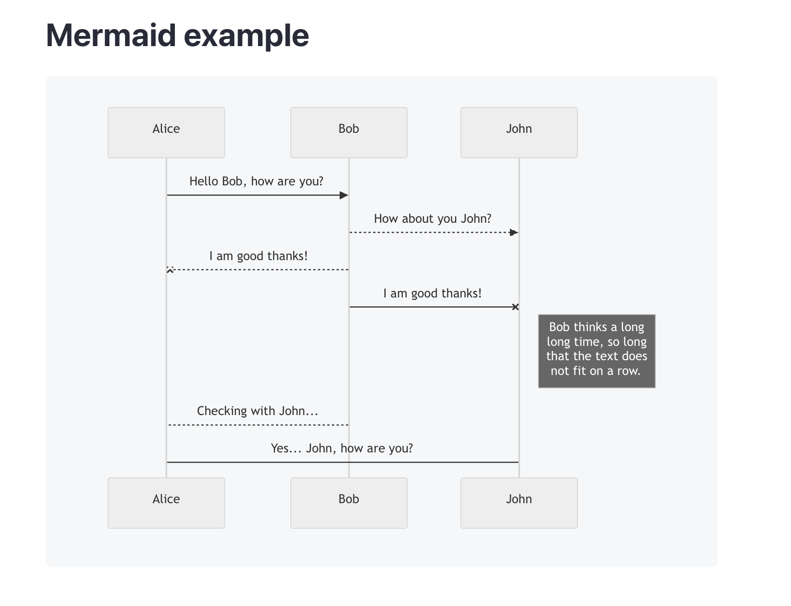
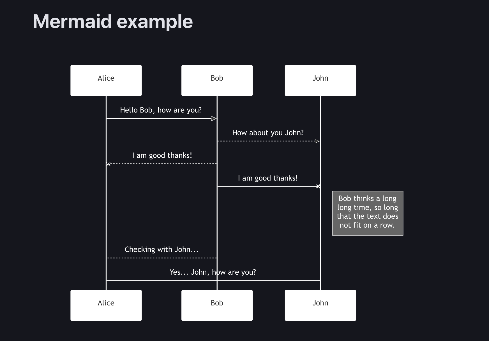

# Publii Mermaid Plugin

Easily render [Mermaid.js](https://mermaid.js.org/) diagrams inside your Publii blog posts and pages using fenced code blocks. Perfect for visualizing flows, sequences, and other structured diagrams in Markdown.




---

## ✨ Features

- Supports Mermaid diagram blocks via ```mermaid
- Automatically loads the Mermaid.js library
- Supports light and dark themes using system preferences
- Works in posts, pages, and excerpts
